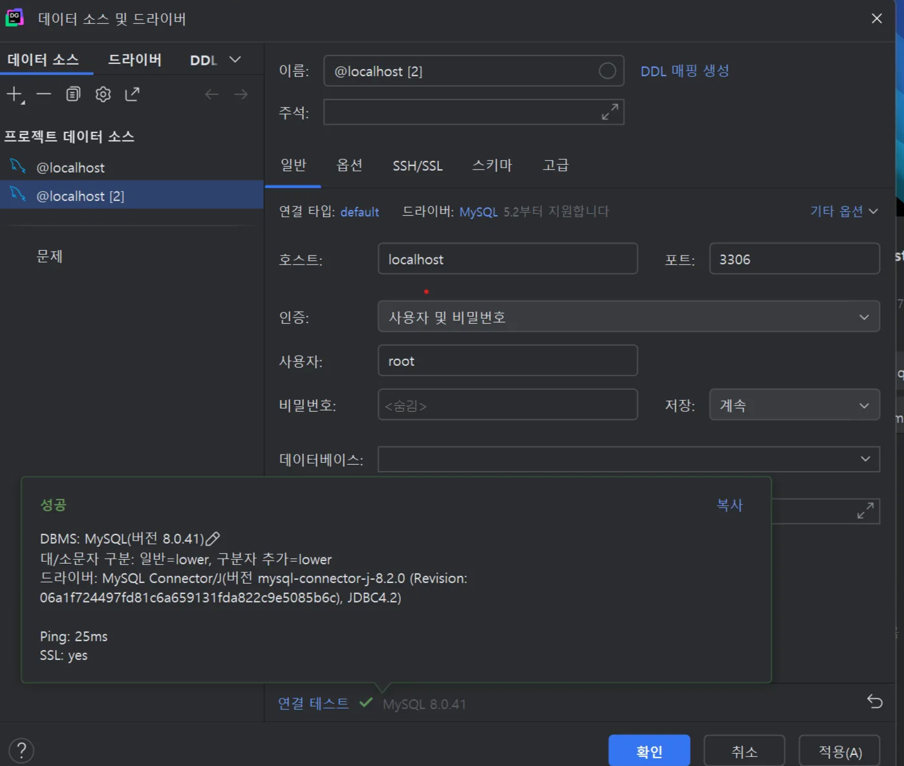
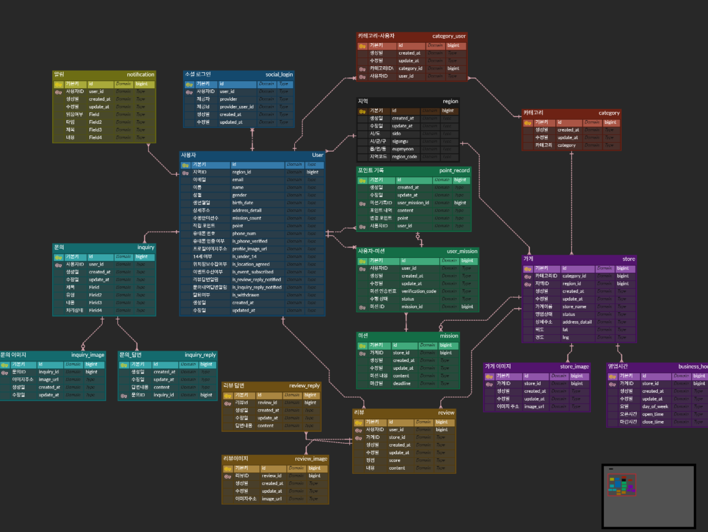

# 1주차

- 로컬 디비 설정하기
    
    
    

- 시니어 미션에 주니어 미션도 포함되어있어서 한번에 정리
- [x]  일반(주니어) 미션에서 제외되었던 부분까지 ERD를 설계해 주세요. 지도 검색, 내 포인트 관리, 알림, 사장님의 자신의 점포 관리하는 부분이 포함됩니다.
    - 어떻게 설계하였는지 간단하게 정리하여 주세요. ERD 자체를 첨부해 주셔도 좋습니다.
        
        [https://www.erdcloud.com/d/2KoJdhH9WhrtKvZmK](https://www.erdcloud.com/d/2KoJdhH9WhrtKvZmK)
        
        
        
        - 사용자 테이블
            
            
            
            - 크게 설명할 부분은 없지만 약관과 소셜로그인을 분리할지 조금 고민했는데, 약관은 분리하면 변경 이력을 추적하기 쉬워지지만 거기까지 필요할까 싶어서 따로 분리하지는 않았음
            - 소셜로그인의 경우는 한명의 사용자가 여러 플랫폼으로 로그인하는 경우가 있을 수 있어, 사용자와 플랫폼이 1:N 관계를 가질 수 있다고 생각하여 따로 분리
        - 알림
            
            
            
            - 알림의 경우 피그마 상으로 알림 종류가 2개 있는 걸로 봤지만 일단 간단하게 단일 테이블로 구현
        - 가게
            
            
            
            - 설계하면서 영업시간을 단일 속성으로 뒀는데 요일별로 다를 수 있다고 생각하여 기능적으로나 정규화 적으로나 다대일관계로 만드는 것이 좋을 것으로 보여 분리
            - 지도상에 위치를 띄우기 위해 별도의 위도, 경도 속성 추가
        - 지역
            
            
            
            - 읍/면/구까지 데이터는 오픈 api를 사용해서 지역코드로 관리할 수 있도록 가정하고 테이블 설계
        - 포인트 기록
            
            
            
        - 사용자 미션 테이블 데이터를 쿼리로 포인트 내역을 정렬 할 수 있지만 포인트 사용내역은 미션 관련 테이블로 기록해두지 않아 사용자별 포인트 적립내용 테이블을 별도로 구성
- [x]  미션 자료로 제공된 피그마를 보고 ERD를 설계한 후 제 1,2,3 정규화를 통해 제 1,2,3 정규형을 만들고 각각 중복된 데이터가 어떻게 변화하였고 어떠한 이점이 있었는 지 작성하여 주세요
    - 내용들을 간단하게 정리하여 주세요
        - 요구사항 정리
            - 회원가입
                - 네이버, 카톡, 애플, 구글 소셜 로그인
                - 약관 5개 필요(선택 2개, 미성년자 구분 1개)
                - 회원가입시 이름, 성별, 생년월일, 주소, 선호 음식 입력
            - 홈화면
                - 지역별 미션 표시
                    - 미션에는 가게명, 음식 종류, 수여 포인트, 마감일, 미션 내용
                        - 미션 내용은 텍스트로만 저장하면되나? 어떤 유형이 있지…
                - 내가 수행한 미션 갯수, 포인트 정보 표시
                - 미션 갯수에 따른 이벤트 필요
            - 미션- 홈
                - 진행중, 진행 완료에 따른 구분 필요
                    - “성공시 5% 적립”는 미션별로 따로 적용되는건가? 아니면 공통 이벤트같은 개념인가?
                        - 이전 화면에서 나온 포인트랑은 별개인가
                    - 화면상에서 좌상단 미션 / 진행중인 미션으로 화면이 다른데 뭐가 다른거지
                - 승인시 미션 인증번호 출력
                    - 사장님 구분 번호가 뭘까
                    - 요청시 생성되는 번호인가, 아니면 db상에 저장된 정보를 가져오는건가
            - 검색
                - 지도에 가게 표시
                - 미션목록표시
                - 가게 정보 표시
                    - 이름, 음식 종류, 영업시간, 별점, 주소,리뷰 사진,
                    - 리뷰
                        - 유저이름, 작성일자, 별점, 내용, 사진
                        - 답글
                            - 작성일자, 내용
                            - 사진은 필요없겠지
            - 마이페이지
                - 여기에 미션성공 메세지가 왜뜨지…?
                - 개인 정보
                    - 프로필 사진, 닉네임, 이메일, 휴대폰 번호, 미인증 여부, 내포인트
                    - 알림 설정
            - 문의
                - 제목, 유형, 내용, 사진, 처리상태
        - 제1,2,3,정규화에 대해
            - 제 1정규화
                - 각 컬럼은 원자값을 가져야한다
            - 제 2정규화
                - 부분 함수 종속 제거
                    - 기본키가 복합키일때 복합키 일부에 종속된 속성은 분리한다
            - 제 3정규화
                - 이행적 함수 종속 제거
                    - 기본키외 다른 키에 따라 결정되는 키는 분리
        - 초기설계
            - 개체별 속성
                - 필요 개체
                    
                    유저, 미션, 가게, 리뷰, 문의, 알림
                    
                    - 유저속성
                        - 로그인 플랫폼
                        - 소셜 로그인 이메일
                        - 14세여부
                        - 위치 정보
                        - 마케팅 수진
                        - 이름
                        - 성별
                        - 생년월일
                        - 주소
                        - 수행한 미션 수
                        - 적립된 포인트
                        - 선호여부 1,2,3…..12
                        - 이벤트 수신 여부
                        - 리뷰 답변 알림
                        - 문의 내역 답변 알림
                        - 탈퇴 여부
                        - 휴대폰 번호
                        - 휴대폰 인증 여부
                        - 프로필 이미지
                    - 가게 속성
                        - 가게이름
                        - 가게 종류
                        - 가게 주소
                        - 가게 사진 n개
                        - 영업시간
                        - 별점
                        - 가게 위도
                        - 가게 경도
                    - 방문미션
                        - 가게이름
                        - 가게 종류
                        - 미션 내용
                        - 적립 포인트
                        - 마감일
                        - 가게 위치정보
                    - 수행 갯수에 따른 미션
                        - 수행갯수
                        - 적립 포인트
                    - 리뷰
                        - 작성자
                        - 별점
                        - 작성일시
                        - 내용
                        - 리뷰사진 n개
                        - 답글 작성일시
                        - 답글 내용
                        - 답글 작성 여부
                    - 문의
                        - 작성자
                        - 제목
                        - 유형
                        - 내용
                        - 처리 상황
                        - 사진n개
                    - 알림
                        - 발송 시간
                        - 읽음 여부
                    - 리뷰 요청 알림
                    - 미션 추가 알림
            - 개체간 관계
                
                <aside>
                💡
                
                사용자 - 소셜 로그인
                
                - 사용자는 여러 소셜 로그인 계정 소유 가능
                - 1 : N관계
                
                사용자 - 알림
                
                - 사용자는 여러 소셜 로그인 계정 소유 가능
                - 1 : N관계
                
                사용자 - 지역
                
                - 지역에는 여러 사용자가 존재할 수 있음
                - 1 : N관계
                
                사용자 - 카테고리
                
                - 사용자는 선호하는 카테고리를 여러개 가질 수 있고, 카테고리도 사용자를 가질 수 있음
                - N : M 관계
                
                사용자 - 미션
                
                - 사용자는 미션을 여러 미션을 동시에 진행 할 수 있고, 미션도 여러 사용자에게 미션을 줄 수 있음
                - N : M 관계
                
                사용자 - 문의
                
                - 사용자는 여러 문의를 소유할 수 있음
                - 1 : N관계
                
                사용자 - 리뷰
                
                - 사용자는 여러 리뷰를 작성 가능
                - 1 : N관계
                
                가게 - 지역
                
                - 지역 내에는 여러 가게가 있을 수 있음
                - 1 : N관계
                
                가게 - 카테고리
                
                - 가게별로 카테고리는 한개씩만 갖는다고 가정
                - 1 : N관계
                
                가게 - 영업시간
                
                - 요일별로 가게의 영업시간이 달라 가게별로 여러개의 영업시간을 갖음
                - 1 : N관계
                
                가게 - 리뷰
                
                - 한 가게에는 여러 개의 리뷰를 갖을 수 있음
                - 1 : N관계
                
                </aside>
                
        - 제 1 정규화
            
            <aside>
            💡
            
            
            
            1차적으로 개념적 erd 설계 후 1정규화 까지 적용하여 완료 
            
            카테고리 - 사용자, 미션 - 사용자등 n : m관계는 중간 테이블을 두었고
            
            사용자, 가게 모두 지역 정보가 필요한데 읍/면/구 정보까지는 별도의 테이블로 관리하고 각 테이블별로 상세 지역을 둬서 관리하도록 설계하였고 
            
            제 1정규화에 따라 주소는 시/도, 시/군/구, 읍/면/구로 분리하고, 가게 영업 시간 데이터도 월별로 다르거나 아침/점심/저녁 영업이 달라지는 경우가 있어 별도의 테이블로 관리하는 방식으로 분리하였음
            
            </aside>
            
        - 제 2 정규화
            - 대리키를 만들어서 복합키를 사용하지 않으니 부분 함수 종속성은 나타나지 않아서 패스
        - 제 3 정규화
            
            <aside>
            💡
            
            
            
            엄밀하게 제3 정규화 위반되는 부분은 없었다
            
            다만, 문의 리뷰 답변이 하나만 달리고 가정하고 설계하였지만, 답변 속성은 따로 분리하는 것이 제3 정규화 관점에서 좋을 것 같아 분리하고, 여러개의 답변을 받을 수 있도록 확장함 
            
            </aside>
            
    
- [x]  피그마의 홈 부분에서 한 사람이 “미션 도전!” 버튼을 빠르게 여러 번 눌렀을 때 여러 가지 이유(비동기 로직 등)로 요청이 지연되어 완전히 처리하기 전 두 번 요청이 들어갈 수 있습니다. 이를 해결할 수 있는 방법에 대해 작성하여 주세요 (ERD 직접적으로 관련이 있기보다는 설계할 때 한번쯤 고민해보면 좋을 것 추가시켜 놓았습니다) (다양한 방법이 있으니 찾아봐 주세요)
    - 내용들을 간단하게 정리하여 주세요
        - 일반적인 상황에서는 문제가 없고 지연에 의해 문제가 발생하였으니 user_id + mission_id로 복합키에 유니크제약 조건이 존재한다고 가정하고 생각
        - 일반적인 상황에서 중복 요청은 방지되어 있으나 앞선 요청의 트랜잭션이 진행중 트랜직션이 시작되는 것을 방지 해야함
            - 자원 독점
            - 요청 태깅
        
        ### Lock
        
        - 낙관적 락
            - 테이블 상에 version 속성을 추가하여 버전에 따라 중복 요청을 무시하는 방법
            
            ```sql
            -- 예시
            CREATE TABLE product (
                id BIGINT PRIMARY KEY AUTO_INCREMENT,
                name VARCHAR(255),
                stock INT NOT NULL,
                version INT NOT NULL DEFAULT 0 -- version를 포함하여 테이블 정의
            );
            
            UPDATE product
            SET stock = stock - 2,
                version = version + 1
            WHERE id = 1
              AND version = 0; -- version 값을 고려하여 update 실행
              
              
            -- 동일한 쿼리가 2개 발생해도 version값에 따라 무시됨
            ```
            
        - 비관적 락
            - 요청에 의해 트랜젝션 발생시 해당 자원에 다른 트랜잭션을 시작할 수 없게 하여 지연에 의한 중복 방지
        - 캐시 단계에서 Lock 활용
            - Redis나 인메모리 캐시를 거쳐갈때 데이터에 대해 짧게 요청을 무시하는 락을 활용
        
        ### 멱등성 키 활용
        
        - 프론트에서 요청을 보내올때 응답이 오기 전까지는 동일한 uuid 키값을 붙혀 요청을 보내도록 처리