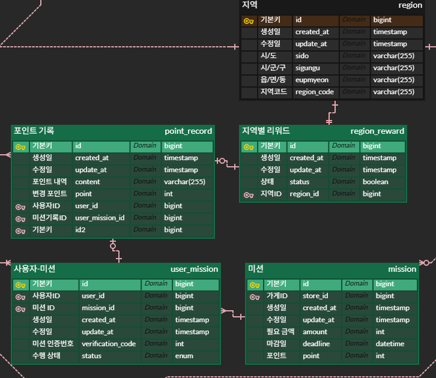

# 미션


1. 내가 진행중, 진행 완료한 미션 모아서 보는 쿼리(페이징 포함)

```sql
select 
	m.point,    -- 획득 포인트
	s.name,     -- 가게 이름
	m.amount,   -- 필요 사용 금액
	m.deadline, -- 마감기한
	s.id        -- 가게id(리뷰작성 접근을 위해)
from user_mission as um
	inner join mission as m on um.mission_id = m.id
	inner join store as s on m.store_id = s.id
where um.user_id = :user_id 
  AND um.status = :status
  AND (
    CASE :status
      WHEN '진행중' THEN m.deadline > NOW() 
      -- 진행 미션을 검색할때는 마감일 이전것만 조회
      ELSE TRUE
    END
  )
order by
	m.deadline asc,
	um.create_at desc
limit :lim 
offset (:page - 1) * :lim;
```

- 제시된 화면은 진행 완료밖에 없는데 진행중의 화면을 표시할때는 마감기한을 기반으로 정렬을해야하지 않을까? 생각을 해봤는데 마감기한 짧게 남은 순서로 우선 정렬해야 할 것 같은데
    - 다만, 마감기한을 기반으로 정렬 기준을 짜면 ‘진행완료’에 해당하는 미션들은 대부분 마감기한이 지났을테니 문제가 될 수 있음
    - 어떤 식으로 정렬할지는 계획쪽이랑 이야기를 해봐야하긴 할 것 같은데, 당장은 잘 모르겠다
    - 일단 쿼리를 진행, 완료 두개로 나눠야 만들긴 편할거 같은데… 한번 동적으로 작동할 수 있도록 작성
- 페이징 방식은 오프셋 페이징을 썼는데, 화면을 보는 동안 미션이 추가되는 일이 생기거나, 아주 예전 미션 목록을 보는 일은 많이 없을 것 같아 커서대신 오프셋 페이징을 사용하였음
- 처음에는 order by 절에서 마감기한에 따른 정렬을 걸었는데, 굳이 order by까지 와서 정렬을 걸어야 하나 싶어서 where단계에서 정렬을 걸음

1. 리뷰 작성하는 쿼리(사진의 경우는 일단 배제)

```sql
insert into review (user_id, store_id, content, score)
values(:user_id, :store_id, :coutent, :score);
```

1. 홈 화면 쿼리(현재 선택 된 지역에서 도전이 가능한 미션 목록, 페이징 포함)

```sql
SELECT
	*
from	mission AS m
inner join store as s on m.store_id = s.id
inner join region as r on r.id = s.region_id
inner join category as c on s.category_id = c.id
left join user_mission AS um ON m.id = um.mission_id 
	AND um.user_id = :user_id
WHERE
    r.code = :code
    AND m.deadline > NOW()
    AND um.mission_id is NULL 
    -- 지역 미션중 진행하지 않은 것
    AND (
        m.deadline > :last_deadline OR
        (m.deadline = :last_deadline AND m.create_at > :last_create_at)
    )
ORDER BY
    m.deadline ASC,
    m.create_at ASC
LIMIT :page_size;

```

- 미션은 다른 곳에서 생성되는거니 커서 기반으로 처리하는 것이 좋을것같아 커서 기반으로 페이징 시도
- 뭔가 딱봐도 조인이 많이 필요할것 같다
- “미션 10개 달성시 1000p”이건 어떻게 처리하지, erd 짤때는 대충 뭉게고 넘어갔던거 같은데, db 상에서 어떻게 기록해야할지….
    
    
    
    - 이 부분을 db 상에서 미션으로 처리해야할까 고민을 많이 했지만, 미션으로 처리하는 것보다 서버에서 요청이 들어오면 포인트 기록에 포인트를 넣어주는 방식이 좋을거 같은데… 지역별로 리워드가 달라상태가 달라야해서, 리워드 획득여부만 구분할 수 있도록 지역별 리워드 테이블 추가
        - 솔직히 이게 맞는 설계인지는 모르겠지만, 실제로 설계할 일이 있으면 미션, 미션외 획득경로, 포인트 사용 같은 포인트 증감 방식을 정확히 이해하고 설계할 것 같음
        - 일단 미션 쿼리만 하는걸로….

1. 마이 페이지 화면 쿼리

```sql
select
    u.name,
    u.email,
    u.phone_num,
    u.is_phone_verified,
    u.profile_image_url,
    COALESCE(SUM(pr.point), 0) as total_points
from
    user AS u
left join
    Point_record AS pr ON u.user_id = pr.user_id
group by
    u.user_id;
```

- 시니어 미션
- [x]  미션 1(내가 진행중, 진행 완료한 미션 모아서 보는 쿼리(페이징 포함))에서 정렬 기준을 1순위는 포인트로 2순위는 최신순으로 하여 Cursor기반 페이지네이션을 구현해보세요
    
    ```sql
    SELECT
    	m.point,    -- 획득 포인트
    	s.name,     -- 가게 이름
    	m.amount,   -- 필요 사용 금액
    	m.deadline, -- 마감기한
    	s.id        -- 가게id(리뷰작성 접근을 위해)
    FROM user_mission AS um
    	INNER JOIN mission AS m ON um.mission_id = m.id
    	INNER JOIN store AS s ON m.store_id = s.id
    WHERE um.user_id = :user_id 
      AND um.status = :status
      AND (
        CASE :status
          WHEN '진행중' THEN m.deadline > NOW() 
          ELSE TRUE
        END
      )
      AND (
          m.point < :last_point
          OR (
          m.point = :last_point 
          AND um.create_at < :last_create_at
          )
      )
    ORDER BY
    	m.point DESC,
    	um.create_at DESC
    LIMIT :lim;
    ```
    

- [x]  SQL Injection에 대해 조사하고 어떠할 때 일어나고 어떻게 막을 수 있는 지를 적어주세요
    - 설명
        
        SQL Injection는 악의적인 sql문은 삽입 하여 데이터를 탈취, 변조시키는 해킹기법
        
        - 예시
            
            ```sql
            SELECT * 
            FROM users 
            WHERE username = '사용자_아이디' 
            	AND password = '사용자_비밀번호';
            	
            -- 다음과 같은 쿼리문이 있다고 할때 '사용자_아이디'부분에 "' OR 1=1 --" 삽입
            
            SELECT * 
            FROM users 
            WHERE username = '' OR 1=1 --' AND password = '사용자_비밀번호';
            
            ```
            username = '' OR 1=1 부분은 참이되고 password 부분은 주석 처리되어 무시됨
            쿼리 결과 users 데이터베이스에서 첫번째 행을 반환
            select 문말고도 drop, delete, update를 통해 값을 변조하거나 지울 수도 있음 
            ```
            ```
            
        - 종류
            - 대역 내 SQL Injection
                - 입력창 등으로 쿼리문에 대한 결과를 즉시 확인할 수 있는 경우
                
                ```sql
                SELECT * FROM products WHERE id = '상품번호'
                
                --  유니온 기반(Union-based) SQL 인젝션
                SELECT id, name FROM products 
                WHERE id = /-1 UNION SELECT 1, password FROM users/
                
                ```
                id = -1임으로 false이지만 union으로 연결된 
                SELECT 1, password FROM users는 실행되어 결과가 반환됨
                ```
                
                --  오류 기반(Error-based) SQL 인젝션
                SELECT * FROM products WHERE id = /1 
                AND (EXTRACTVALUE(1, CONCAT(0x5c, (SELECT password FROM users LIMIT 1))))/ --
                ```
                EXTRACTVALUE는 xml을 파싱하는 함수이지만 인자에 비밀번호문자열을 넣어 
                의도적으로 오류를 발생시키고 오류메세지로 비밀번호 문자열을 출력시킴
                ```
                ```
                
            - 공격 결과를 직접 볼 수 없는 상황에서 사용하는 공격 방법
                - 블라인드 SQL Injection
                    - 쿼리문의 결과문을 볼 수 없기 때문에 간접적인 방식을 사용
                    - 불리언(Boolean) 기반 방식
                        
                        ```sql
                        ...AND (
                        SELECT SUBSTRING(password, 1, 1) = 'a' 
                        FROM users LIMIT 1
                        ) --
                        ```
                        
                    - 시간 기반(Time-based) 방식
                        
                        ```sql
                        ...AND IF((
                        SELECT SUBSTRING(password, 1, 1) = 'a' 
                        FROM users LIMIT 1
                        ), SLEEP(5), 0) --
                        ```
                        
                - 대역 외 SQL Injection
                    - 블라인드 SQL Injection과 비슷하지만 웹사이트를 이용하지 않고 외부채널을 통해 유출됨
        - 해결 방법
            - 매개변수화된 쿼리
                - 리터럴 문자열로 변수를 받으면 쿼리조각을 쿼리문의 일부로 받을 수도 있음
                - =?, = :id 등으로 플레이스 홀더로 하면 입력 데이터는 쿼리의 일부가 아닌 순수 데이터로 인식함
            - 입력 유효성 검사
                - 데이터 타입 검사, 길이 제한, 정규식사용
            - 최소 권한 원칙
                - 운영계정에서는 필요에 따라 권한을 달리 부여함
            - 에러메세지 상세 제한

- [x]  다양한 JOIN 방법들에 대해 찾아보고, 각 방식에 대해 비교하여 간단히 정리해주세요.
    - 설명
        
        
        - Employees
        
        | ID | Name | ManagerID | DepartmentID |
        | --- | --- | --- | --- |
        | 1 | 김철수 | NULL | 10 |
        | 2 | 박영희 | 1 | 20 |
        | 3 | 이민지 | 2 | 10 |
        | 4 | 최수현 | 3 | 30 |
        | 5 | 홍길동 | 4 | NULL |
        
        - Departments
        
        | ID | DepartmentName |
        | --- | --- |
        | 10 | 영업부 |
        | 20 | 개발팀 |
        | 30 | 마케팅팀 |
        | 40 | 인사부 |
        
        1. inner join
            1. 보편적으로 많이 쓰이는 조인 방식으로 조인하는 두 테이블에 해당하는 컬럼이 둘다 있어야 조인 결과에 포함시키는 조인 방법
                
                
                
                | ID | Name | ManagerID | DepartmentID | DepartmentName |
                | --- | --- | --- | --- | --- |
                | 1 | 김철수 | NULL | 10 | 영업부 |
                | 2 | 박영희 | 1 | 20 | 개발팀 |
                | 3 | 이민지 | 2 | 10 | 영업부 |
                | 4 | 최수현 | 3 | 30 | 마케팅팀 |
                
                ```sql
                select * 
                from employees as e 
                	inner join departments as d on e.DepartmentID = d.id
                ```
                
            2. 한쪽이라도 없는 DepartmentID를 기준으로 부서가없는 홍길동과 사원이 없는 인사부는 포함 되지 않음
        2. outer join
            
            
            
            1. 두 테이블중 하나만 존재해도 결과에 포함 시키는 조인 방식으로 세부적인 방식에 따라 left join, right join, full outer join이 존재함
                1. left join, right join
                    1. left 혹은 right을 기준으로 매칭되는 행이 있으면 포함시키고 없으면 NULL로 조인 결과에 포함시키는 방식
                    
                    | ID | Name | ManagerID | DepartmentID | DepartmentName |
                    | --- | --- | --- | --- | --- |
                    | 1 | 김철수 | NULL | 10 | 영업부 |
                    | 2 | 박영희 | 1 | 20 | 개발팀 |
                    | 3 | 이민지 | 2 | 10 | 영업부 |
                    | 4 | 최수현 | 3 | 30 | 마케팅팀 |
                    | 5 | 홍길동 | 4 | NULL | NULL |
                    
                    ```sql
                    --- employees를 기준으로 조회한 조인 테이블
                    
                    -- left join
                    select * 
                    from employees as e 
                    left join departments as d on e.DepartmentID = d.id
                    -- right join
                    select * 
                    from departments as d
                    right join employees as e on d.id = e.DepartmentID
                    ```
                    
                2. full outer join
                    1. left와 right join를 동시하는 조인으로 양쪽테이블에 있는 값을 모두 표시함
                    2. 값이 없는 부분은 NULL 표시
                        
                        
                        | ID | Name | ManagerID | DepartmentID | DepartmentName |
                        | --- | --- | --- | --- | --- |
                        | 1 | 김철수 | NULL | 10 | 영업부 |
                        | 2 | 박영희 | 1 | 20 | 개발팀 |
                        | 3 | 이민지 | 2 | 10 | 영업부 |
                        | 4 | 최수현 | 3 | 30 | 마케팅팀 |
                        | 5 | 홍길동 | 4 | NULL | NULL |
                        | NULL | NULL | NULL | 40 | 인사부 |
                        
                        ```sql
                        select * 
                        from employees as e 
                        outer join departments as d on e.DepartmentID = d.id
                        ```
                        
        3. cartesian join(cross join)
            1. 참조에 상관 없이 모든행렬의 결합을 표기함
        4. self join
            1. 한 테이블에 다른 열을 기준으로 조인하는것
            2. 별칭을 지정할때 다른 이름으로 지정하여 사용해야함