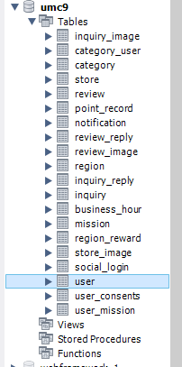
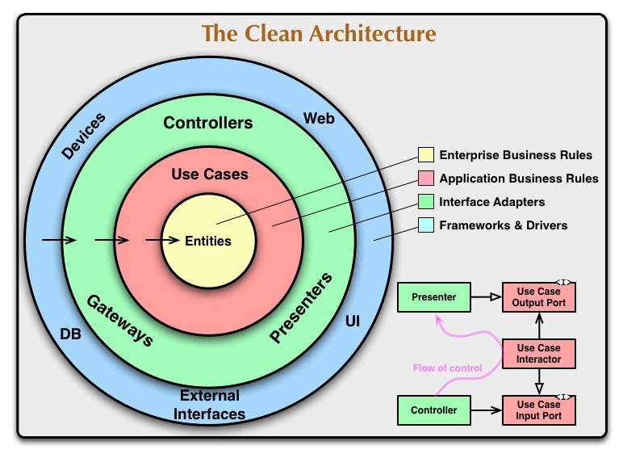

# 4

## 미션 1




- 사용 쿼리
    
    ```sql
    CREATE TABLE `user_mission` (
    	`id`	bigint	NOT NULL,
    	`user_id`	bigint	NULL,
    	`mission_id`	bigint	NOT NULL,
    	`created_at`	timestamp	NULL,
    	`update_at`	timestamp	NULL,
    	`verification_code`	int	NULL,
    	-- 미션 상태: 진행 중, 완료, 실패 등
    	`status`	enum('PENDING','COMPLETED','FAILED','EXPIRED')	NULL 
    );
    
    ---
    
    CREATE TABLE `business_hour` (
    	`id`	bigint	NOT NULL,
    	`store_id`	bigint	NOT NULL,
    	`created_at`	timestamp	NULL,
    	`update_at`	timestamp	NULL,
    	-- 요일: 월요일부터 일요일
    	`day_of_week`	enum('MON','TUE','WED','THU','FRI','SAT','SUN')	NULL,
    	`open_time`	time	NULL,
    	`close_time`	time	NULL
    );
    
    ---
    
    CREATE TABLE `inquiry` (
    	`id`	bigint	NOT NULL,
    	`user_id`	bigint	NOT NULL,
    	`created_at`	timestamp	NULL,
    	`update_at`	timestamp	NULL,
    	`title`	varchar(255)	NULL,
    	-- 문의 유형: 일반 문의, 오류 신고, 제휴 문의 등
    	`type`	enum('GENERAL','BUG_REPORT','PARTNERSHIP','ETC')	NULL,
    	`content`	text	NULL,
    	-- 문의 처리 상태: 대기, 처리 중, 완료
    	`status`	enum('PENDING','IN_PROGRESS','COMPLETED')	NULL
    );
    
    ---
    
    CREATE TABLE `region` (
    	`id`	bigint	NOT NULL,
    	`created_at`	timestamp	NULL,
    	`update_at`	timestamp	NULL,
    	`sido`	varchar(255)	NULL,
    	`sigungu`	varchar(255)	NULL,
    	`eupmyeon`	varchar(255)	NULL,
    	`region_code`	varchar(255)	NULL
    );
    
    ---
    
    CREATE TABLE `store` (
    	`id`	bigint	NOT NULL,
    	`category_id`	bigint	NOT NULL,
    	`region_id`	bigint	NOT NULL,
    	`created_at`	timestamp	NULL,
    	`update_at`	timestamp	NULL,
    	`store_name`	varchar(255)	NULL,
    	-- 상점 상태: 영업 중, 일시 중단, 폐업
    	`status`	enum('OPEN','PAUSED','CLOSED')	NULL,
    	`address_datail`	varchar(255)	NULL,
    	`lat`	double	NULL,
    	`lng`	double	NULL
    );
    
    ---
    
    CREATE TABLE `inquiry_reply` (
    	`id`	bigint	NOT NULL,
    	`created_at`	timestamp	NULL,
    	`update_at`	timestamp	NULL,
    	`content`	text	NULL,
    	`inquiry_id`	bigint	NOT NULL
    );
    
    ---
    
    CREATE TABLE `review_image` (
    	`id`	bigint	NOT NULL,
    	`review_id`	bigint	NOT NULL,
    	`created_at`	timestamp	NULL,
    	`update_at`	timestamp	NULL,
    	`image_url`	varchar(255)	NULL
    );
    
    ---
    
    CREATE TABLE `User_Consents` (
    	`id`	bigint	NOT NULL,
    	`user_id`	bigint	NOT NULL,
    	-- 동의 유형: 필수 동의, 선택 동의
    	`type`	enum('REQUIRED','OPTIONAL')	NULL,
    	`created_at`	timestamp	NULL,
    	`updated_at`	timestamp	NULL
    );
    
    ---
    
    CREATE TABLE `review_reply` (
    	`id`	bigint	NOT NULL,
    	`review_id`	bigint	NOT NULL,
    	`created_at`	timestamp	NULL,
    	`update_at`	timestamp	NULL,
    	`content`	text	NULL
    );
    
    ---
    
    CREATE TABLE `User` (
    	`id`	bigint	NOT NULL,
    	`region_id`	bigint	NOT NULL,
    	`email`	varchar(255)	NULL,
    	`name`	varchar(255)	NULL,
    	-- 사용자 성별: male, female, other (기존 정의 유지)
    	`gender`	enum('male','female','other')	NULL,
    	`birth_date`	date	NULL,
    	`address_detail`	varchar(255)	NULL,
    	`phone_num`	varchar(255)	NULL,
    	`is_phone_verified`	boolean	NULL,
    	`profile_image_url`	varchar(255)	NULL,
    	`is_under_14`	boolean	NULL,
    	`is_location_agreed`	boolean	NULL,
    	`is_event_ subscribed`	boolean	NULL,
    	`is_review_reply_notified`	boolean	NULL,
    	`is_inquiry_reply_notified`	boolean	NULL,
    	`is_withdrawn`	boolean	NULL,
    	`created_at`	timestamp	NULL,
    	`updated_at`	timestamp	NULL
    );
    
    ---
    
    CREATE TABLE `store_image` (
    	`id`	bigint	NOT NULL,
    	`store_id`	bigint	NOT NULL,
    	`created_at`	timestamp	NULL,
    	`update_at`	timestamp	NULL,
    	`image_url`	varchar(255)	NULL
    );
    
    ---
    
    CREATE TABLE `category_user` (
    	`id`	bigint	NOT NULL,
    	`created_at`	timestamp	NULL,
    	`update_at`	timestamp	NULL,
    	`category_id`	bigint	NOT NULL,
    	`user_id`	bigint	NOT NULL
    );
    
    ---
    
    CREATE TABLE `review` (
    	`id`	bigint	NOT NULL,
    	`user_id`	bigint	NOT NULL,
    	`store_id`	bigint	NOT NULL,
    	`created_at`	timestamp	NULL,
    	`update_at`	timestamp	NULL,
    	`score`	float	NULL,
    	`content`	text	NULL
    );
    
    ---
    
    CREATE TABLE `category` (
    	`id`	bigint	NOT NULL,
    	`created_at`	timestamp	NULL,
    	`update_at`	timestamp	NULL,
    	`category`	varchar(255)	NULL
    );
    
    ---
    
    CREATE TABLE `social_login` (
    	`id`	bigint	NOT NULL,
    	`user_id`	bigint	NOT NULL,
    	`provider`	varchar(255)	NULL,
    	`created_at`	timestamp	NULL,
    	`updated_at`	timestamp	NULL
    );
    
    ---
    
    CREATE TABLE `region_reward` (
    	`id`	bigint	NOT NULL,
    	`created_at`	timestamp	NULL,
    	`update_at`	timestamp	NULL,
    	`status`	boolean	NULL,
    	`region_id`	bigint	NOT NULL
    );
    
    ---
    
    CREATE TABLE `notification` (
    	`id`	bigint	NOT NULL,
    	`user_id`	bigint	NOT NULL,
    	`created_at`	timestamp	NULL,
    	`update_at`	timestamp	NULL,
    	`is_read`	boolean	NULL,
    	-- 알림 유형: 시스템, 이벤트, 리뷰 답글
    	`type`	enum('SYSTEM','EVENT','REVIEW_REPLY','INQUIRY_REPLY')	NULL,
    	`title`	varchar(255)	NULL,
    	`content`	text	NULL
    );
    
    ---
    
    CREATE TABLE `inquiry_image` (
    	`id`	bigint	NOT NULL,
    	`inquiry_id`	bigint	NOT NULL,
    	`image_url`	varchar(255)	NULL,
    	`created_at`	timestamp	NULL,
    	`update_at`	timestamp	NULL
    );
    
    ---
    
    CREATE TABLE `mission` (
    	`id`	bigint	NOT NULL,
    	`store_id`	bigint	NOT NULL,
    	`created_at`	timestamp	NULL,
    	`update_at`	timestamp	NULL,
    	`amount`	int	NULL,
    	`deadline`	datetime	NULL,
    	`point`	int	NULL
    );
    
    ---
    
    CREATE TABLE `point_record` (
    	`id`	bigint	NOT NULL,
    	`created_at`	timestamp	NULL,
    	`update_at`	timestamp	NULL,
    	`content`	varchar(255)	NULL,
    	`point`	int	NULL,
    	`user_id`	bigint	NOT NULL,
    	`user_mission_id`	bigint	NOT NULL,
    	`id2`	bigint	NOT NULL
    );
    ```
    

## 미션 2


## 시니어 미션

### 🧙‍♂️ 시니어 미션

- ECMAScript의 의미, 그리고 ES6 이후에는 각 버전에 따라 어떤 기능들이 새로 추가되었는지 찾고 정리해주세요.
    
    <aside>
    💡
    
    - ECMA
        - **유럽 컴퓨터 제조업 협회 (European Computer Manufacturers Association)의 약자**로 유럽의 컴퓨터 시스템을 표준화 하기 위해 창설된 기구지만, 현재는 유럽에서 확장하여 정보 통신 기술의 국제 표준을 제정하는 국제 비영리 기구 Ecma 인터네셔널을 뜻함
    
    - ECMAScript
        - ECMA가 규정한 국제 표준중 스크립트 언어의 표준 규범인 [ECMA-262](https://ecma-international.org/publications-and-standards/standards/ecma-262/)를 따르는 스크립트 언어를 뜻한다(자바스크립트 말고도 다른 스크립트 언어도 있다고함)
    
    - ES6 ( ES2015 )
        - ECMA가 2015년에 업데이트한 ECMAScript의 6번째 버전으로 자바스크립트으로 현대적인 프로그래밍이 가능하도록 도입한 기능이 많아 Node, React등 JS 기반 라이브러리들은 ES6를 기반으로 채택되어 사용되고 있다
        - 추가된 기능
            - 변수 선언 방식
                - **호이스팅 문제**와 **함수레벨 스코프**를 가진 **var** 형을 대체할 **let, const** 추가
            - 화살표 함수 추가
            - 클래스 추가
            - 객체 리터럴 강화
            - 템플릿 문자열 추가
            - 구조분해 할당 추가
            - 모듈 시스템 추가
            - 기본 매개변수 추가
            - 나머지 매개변수 추가
            - spread 연산자 추가
            - 반복자 for …of 추가
            - 등등… 추가
        - [참고 문서](https://github.com/lukehoban/es6features)
    - ES2016
        - 지수 연산자 (Exponentiation Operator) - `**`
        - Array.prototype.includes()
    - ES2017
        - Async / Await (비동기 함수)
        - 객체 관련 메서드 추가
            - Object.values(obj)
            - Object.entries(obj)
            - Object.getOwnPropertyDescriptors(obj)
        - 문자열 패딩
            - String.prototype.padStart(targetLength, padString)
            - String.prototype.padEnd(targetLength, padString)
        - 함수 매개변수 목록 및 호출의 후행 쉼표 (Trailing Commas)
    - ES2018
        - 객체 Rest/Spread 프로퍼티
            - ES6이후로 ES9전까지는 배열에서만 사용 가능했음
        - Promise.prototype.finally()
        - 비동기 이터레이터 및 `for await...of`
        - 정규 표현식(RegExp) 기능 강화
    - ES2019
        - 평탄화 매서드
            - Array.prototype.flat()
            - Object.fromEntries()
        - Object.fromEntries()
            - Object.entries()의 역
        - `String.prototype.trimStart()` 및 `trimEnd()`
            - 앞 혹은 뒤 공백 제거
        - 선택적 `catch` 바인딩
            - catch에 err 객체를 쓰지 않으면 생략 가능
        - Symbol.prototype.description
    - ES2020
        - 옵셔널 체이닝 연산자 (Optional Chaining Operator) - `?.`
        - 널 병합 연산자 (Nullish Coalescing Operator) - `??`
        - BigInt 타입 추가
        - Promise.allSettled()
        - 동적 `import()`
        - String.prototype.matchAll()
    - ES2021
        - String.prototype.replaceAll()
        - Promise.any()
        - 논리 할당 연산자 &&=
        - `WeakRef` & `FinalizationRegistry`
        - 숫자 구분자 (Numeric Separators)
    - ES2022
        - 최상위 `await` (Top-level `await`)
        - `.at()` 메서드 (`Array`/`String` 등)
        - 클래스 필드 (Class Fields)
        - 오류 원인 (Error Cause)
        - 객체의 Private 필드에 대한 `in` 연산자
    - ES2023
        - 원본 배열을 변경하지 않는 배열 메서드 (Change Array by Copy)
        - `Array.prototype.findLast()` 및 `findLastIndex()`
        - 해시뱅 문법 (Hashbang Grammar)
        - `WeakMap`의 키로 Symbol 지원
    - ES2024
        - `.groupBy()` 메서드 (`Object` 및 `Map`)
        - Promise.withResolvers()
        - 정규 표현식 `v` 플래그 (Unicode Sets)
        - 올바른 형식의 유니코드 문자열 확인 (`isWellFormed`/`toWellFormed`)
        - 크기 조절 가능 및 전송 가능한 `ArrayBuffer`
        - Atomics.waitAsync()
    </aside>
    
- 워크북에서 소개한 프로젝트 아키텍처(Controller, Service, Data Access) 구조에 대해 더 정리하고, Data Access(DB) 레이어와의 결합도를 낮출 수 있는 구조를 고민해주세요.
    
    <aside>
    💡
    
    1. 프로젝트 아키텍처를 더 정리하라는 말이 무엇일까…. 잘 모르겠다
    2. Data Access(DB) 레이어와의 결합도를 낮출 수 있는 구조를 고민해주세요
        - 일단 레이어간 결합도가 높다는 말이 무엇일까? 결합도가 높다는 것은 한 레이어가 수정될때 다른 레이어가 수정될 때, 그 레이어가 참조하는/ 참조 받는 레이어도 수정될 가능성이 높은 상태를 말하고, 이런 결합도가 높은 상태는 유지 보수 차원에서 좋지 못하다
        - 객체지향 5원칙으로 불리는 SOILD의 마지막 D는 DIP 의존 역전 원칙을 뜻하는데
            
            <aside>
            💡
            
            1. 고수준 모듈은 저수준 모듈에 의존해서는 안 된다. 이들 모두 추상화에 의존해야 한다.
            2. 추상화는 세부 사항에 의존해서는 안 된다. 세부 사항이 추상화에 의존해야 한다.
            </aside>
            
            를 의미한다. 
            
            객체지향 프로그래밍 과정에서 지켜야할 원칙이라 Node.Js에서도 1대1로 적용할 수 있을지 모르겠지만, 결합도를 낮춰야한다는 목적에서 비슷한 결을 가지고 있는 문제이다. 이러한 문제에서 Java spring과 같은 객체지향 프로그래밍에서는 DI 패턴을 사용한다
            
        - DI(Dependency Injection, 의존성 주입) 패턴은 객체 내에서 참조(=사용)하는 외부 객체를 객체 내부가 아닌 외부에서 주입 받는 디자인 패턴이다.
            - 코드 작성 중에는 인터페이스(=객체 설계도)를 기반으로 코드를 작성하여 인터페이스의 구현체가 어떻게 되어있는지는 상관이 없도록 하여 느슨한 결합으로 구현한다.
    
    </aside>
    
- 클린 아키텍처(Clean Architecture)와 의존성(Dependency)의 방향에 대해서도 찾아본 후 정리해주세요.
    
    <aside>
    💡
    
    클린 아키텍처
    
    - [https://blog.cleancoder.com/uncle-bob/2012/08/13/the-clean-architecture.html](https://blog.cleancoder.com/uncle-bob/2012/08/13/the-clean-architecture.html)
    
    
    
    클린 아키텍쳐는 아키텍처 설계시 유지보수, 테스트, UI, DB, 실행환경에 대한 독립성을 가지도록 설계하는 방식의 원칙을 정리한것으로 의존성의 방향을 골자로 하는 방식이다.
    
    - 의존성 규칙
        - 아키텍쳐에서 코드의 의존성은 안쪽으로 갈 수록 고수준 정책인 위 그림과 같이 안쪽으로만 향해야한다. 즉, 고수준 정책은 상대적으로 저수준 정책에 대해 의존하면 안된다는 원칙이다
        - 위 그림과 원 블로그에서는 엔티티, 유스 케이스, 인터페이스 어댑터, 프레임워크 및 드라이버로 나눠 서명 했는데
            - 엔티티 - 핵심 비즈니스 규칙
            - 유스 케이스 - 엔티티에 의존하여 특정한 비즈니스 흐름을 만들어내는 정책
            - 인터페이스 어댑터 - MVC나 DB 접근등 외부와 교환하기 위한 정책
            - 프레임워크 및 드라이버  - DB, 웹, 프레임워크등 애플리케이션 최외곽
            
            를 의미한다
            
    - 경계간 흐름
        - 서비스 흐름상 데이터는 바깥쪽에서 시작해 안쪽을 거쳐 다시 바깥 쪽으로 나와야하는데, 안쪽은 바깥쪽에 세부정보를 모르기 때문에 이러한 흐름에 대응하기 위해 DIP에 대응하는 패턴으로 개발되어야한다
    - 경계간 데이터
        - 경계들 이동하는 데이터는 프레임워크에 종속되지 않은 단순한 데이터 형태여야하고, 데이터간 이동에서 안쪽 계층이 편리한 형식으로 보내져야한다는 규칙이 존재한다
    </aside>